# Spatial Analysis of a Prison Floor Plan

**Author:** G. Ramon Garcia Ayala  
**Course:** MaCAD — Graph Machine Learning  
**Institution:** IAAC — Institute for Advanced Architecture of Catalonia  
**Assignment:** S03-04 — Submission 02

---


*Original cell layout of the Barnimstrasse women's prison in Berlin — the reference floor plan used for this analysis.*

## About this project

The idea behind this project was to evaluate how a prison works from a spatial perspective: which areas are easy to reach, which ones are hard to get to, where people naturally pass through, and how the layout itself creates zones of control or isolation. Prisons are interesting because their floor plans are designed precisely to manage movement and visibility, so applying graph theory to them makes a lot of sense.

I used the floor plan of the Barnimstrasse women's prison in Berlin as the base geometry. The plan was imported into `topologicpy`, sliced into a grid, and then converted into a graph where each walkable cell becomes a node and adjacent cells are connected by edges. From there I ran several spatial analyses — shortest paths, centrality metrics, community detection, and visibility — to understand the building beyond what a regular floor plan shows.

---

## Workflow

The analysis is split across five notebooks plus an orchestrator script that runs them in sequence:

| Notebook | Description |
|----------|-------------|
| `NB-01` | Geometry import, grid overlay, and graph construction |
| `NB-02` | Graph metrics and shortest path calculation |
| `NB-03` | Closeness and betweenness centrality analysis |
| `NB-04` | Community detection and degree centrality |
| `NB-05` | Visibility / isovist analysis |
| `orchestrator.py` | Runs all notebooks end-to-end |

---

## Results

### 01 — Floor Plan Import
> **Type:** Base geometry

The original prison floor plan loaded into the analysis environment. This is the starting point — the raw architectural layout with all walls, doors, and corridors visible.

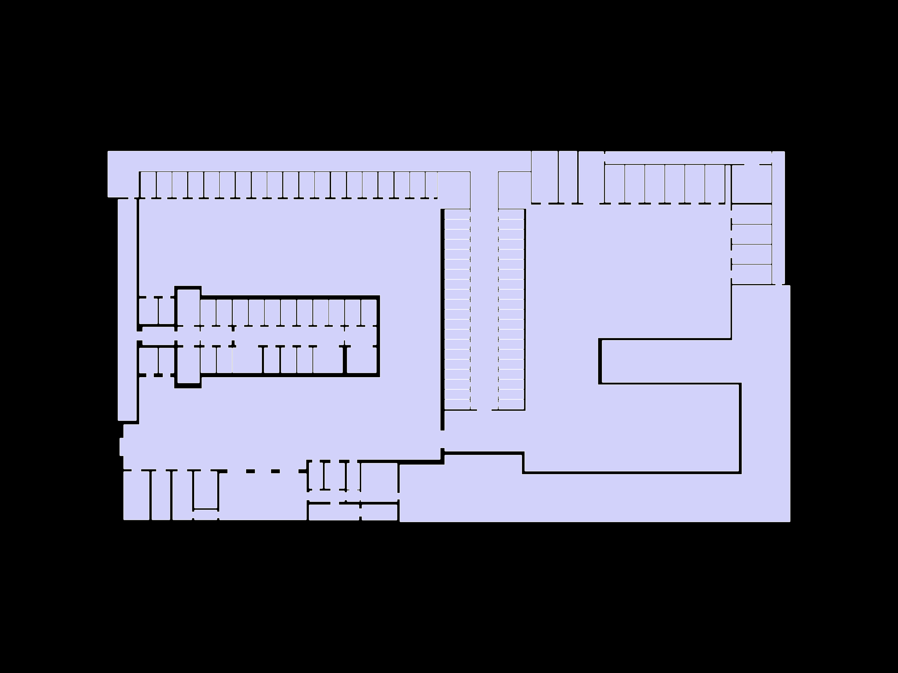

---

### 02 — Grid Overlay
> **Type:** Spatial discretization

A regular grid is overlaid on top of the floor plan. Each cell of the grid will become a node in the graph. This step converts the continuous geometry into a discrete set of points that can be analyzed with graph algorithms.

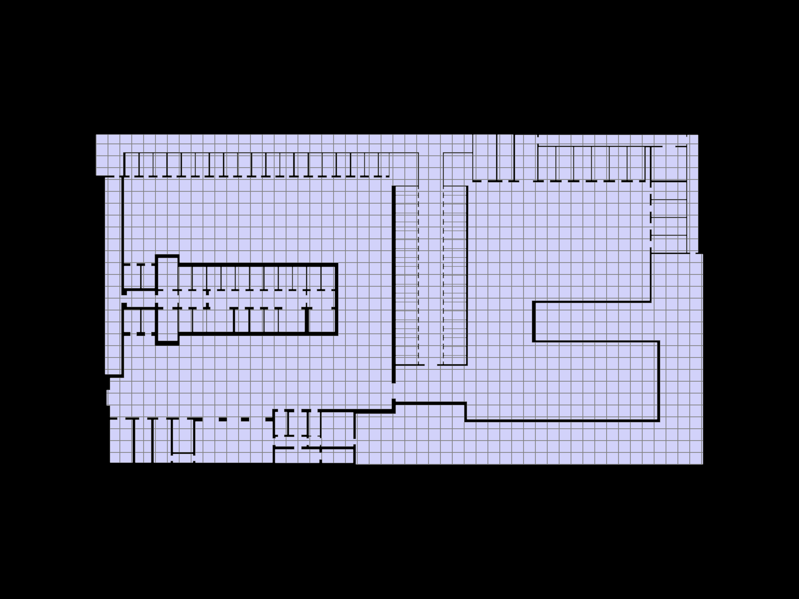

---

### 03 — Sliced Shell
> **Type:** Refined grid

A finer grid resolution applied to the floor plan to capture more spatial detail. The denser mesh allows the analysis to pick up on smaller corridors and transitions between spaces that a coarser grid would miss.

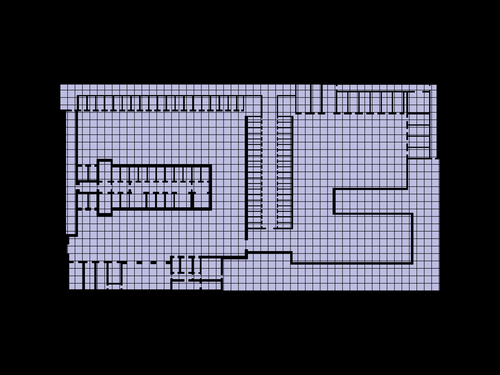

---

### 04 — Analysis Graph
> **Type:** Graph construction (nodes + edges)

The graph built from the grid — red nodes and edges represent the connectivity between walkable cells. This is the underlying data structure that all subsequent analyses work on. You can see how the graph follows the shape of the corridors and open spaces.

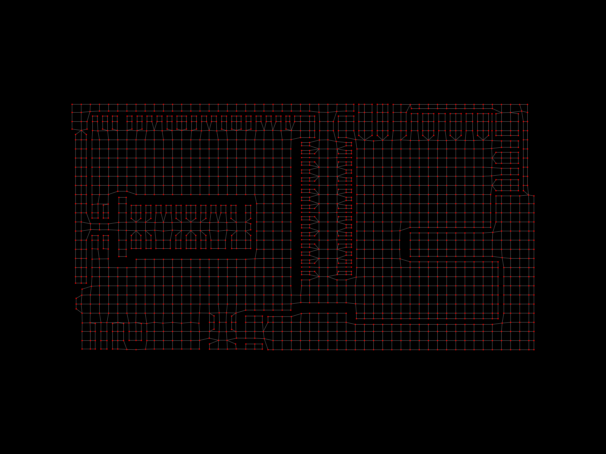

---

### 06 — Shortest Path
> **Type:** Path analysis

Two shortest paths calculated between different pairs of points in the prison (shown in red and blue). This helps understand the minimum number of steps needed to move between areas — useful for evaluating how easy or hard it is to transit from one zone to another.

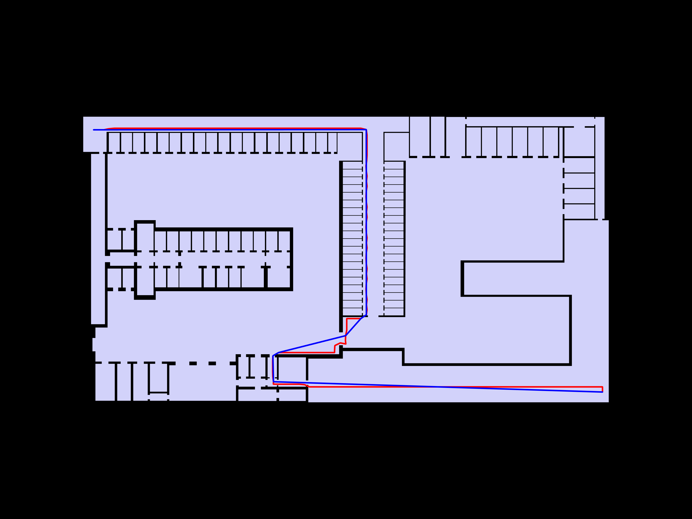

---

### 07 — Closeness Centrality
> **Type:** Centrality heatmap

A heatmap where warm colors (yellow) indicate areas that are close to all other areas in the graph, and cool colors (dark blue/purple) indicate isolated zones. The central corridors score high, meaning they are the most accessible points in the building. The individual cells on the left wing and the corners are the most isolated.

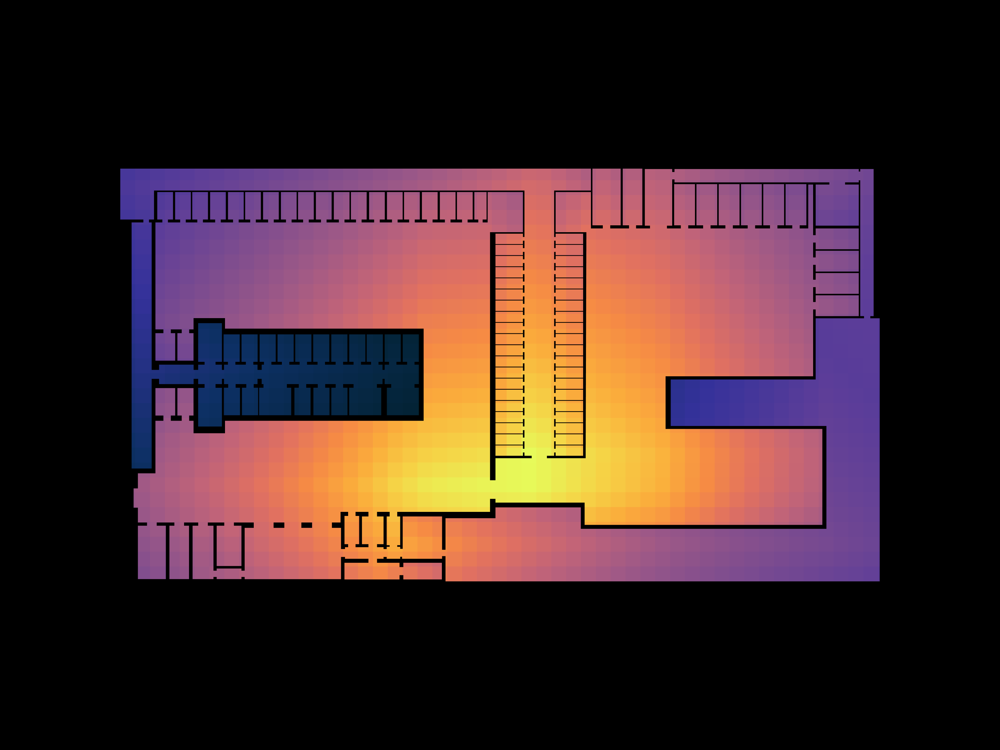

---

### 08 — Betweenness Centrality
> **Type:** Centrality heatmap

This heatmap highlights areas that act as bridges or bottlenecks — spaces that many shortest paths pass through. The brighter spots (pink/purple) near the central staircase and the main corridor intersection show where movement is funneled. These are critical control points in the prison layout.

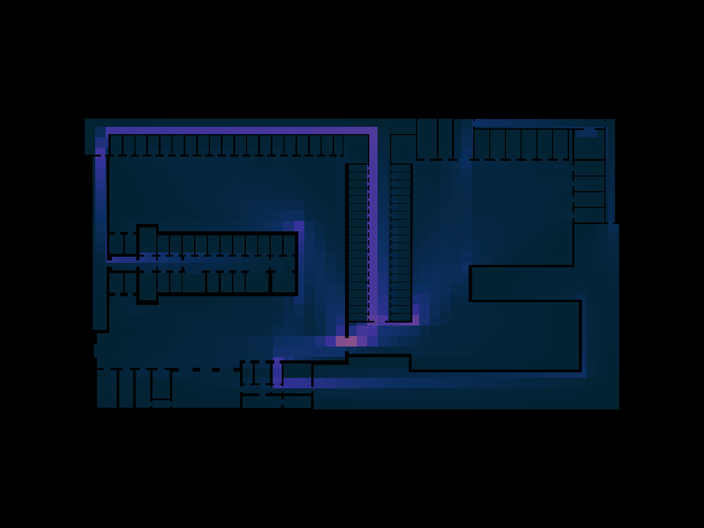

---

### 09 — Community Partition
> **Type:** Community detection (Louvain)

The floor plan divided into communities using a graph partitioning algorithm. Each color represents a cluster of spaces that are more connected to each other than to the rest of the building. This reveals the natural "zones" of the prison — groups of rooms that function together as a unit.

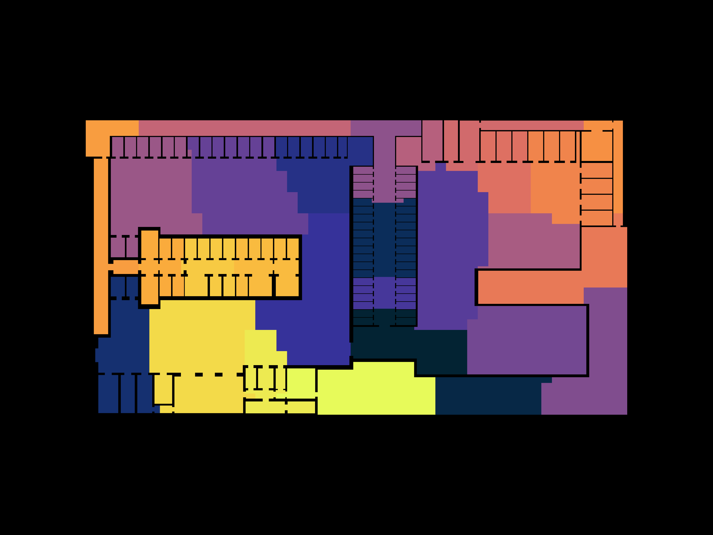

---

### 10 — Community Zones
> **Type:** Simplified zone map

A cleaner version of the community detection result, showing the detected zones as distinct regions without the color noise. This makes it easier to see how the algorithm groups the cell blocks, corridors, and service areas into separate functional zones.

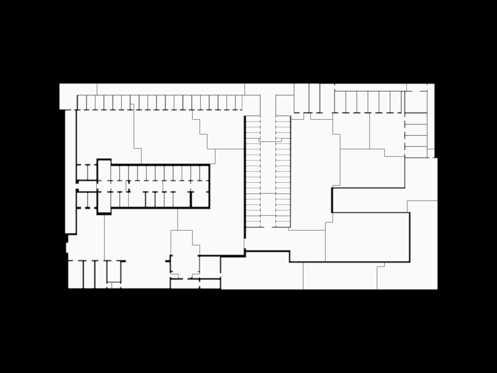

---

### 11 — Community Graph
> **Type:** Dual graph overlay

The community graph overlaid on the floor plan — each red dot represents the centroid of a detected room/space, and the red lines show which spaces are directly connected. This is the dual graph of the building: a simplified network that summarizes the spatial relationships between all rooms.

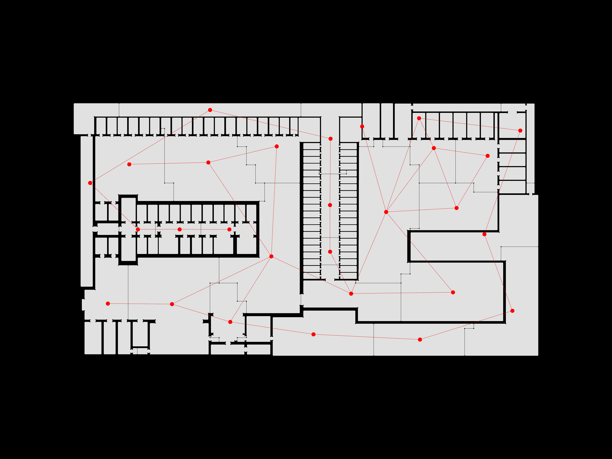

---

### 12 — Degree Centrality
> **Type:** Centrality heatmap

Degree centrality mapped onto the floor plan. Bright areas (yellow/orange) have many direct connections to neighboring cells, meaning they are open, well-connected spaces. Dark areas have fewer connections — they are more enclosed or dead-end spaces. The large open area on the right side of the building scores highest.

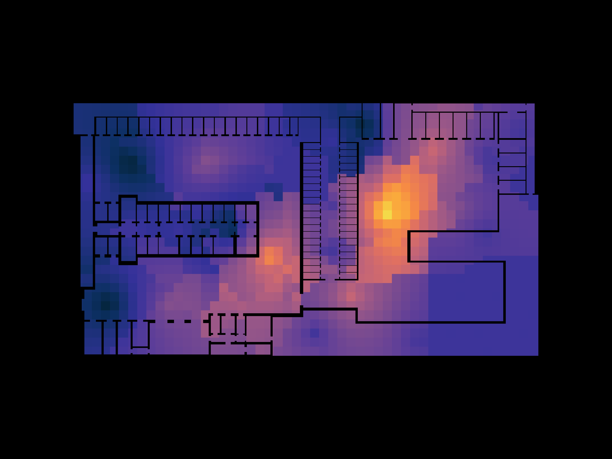

---

## Tools

| Tool | Purpose |
|------|---------|
| [topologicpy](https://github.com/wassimj/topologicpy) | Topological modeling and graph construction |
| NetworkX | Graph algorithms (centrality, shortest path, community detection) |
| Matplotlib | Visualization and heatmaps |
| Python 3.x / Jupyter | Analysis environment |

---

## How to run

1. Install dependencies:
   ```bash
   pip install topologicpy networkx matplotlib
   ```
2. Run the orchestrator from the `notebooks/` folder:
   ```bash
   python orchestrator.py
   ```
   Or open each notebook individually in order (`NB-01` through `NB-05`).
